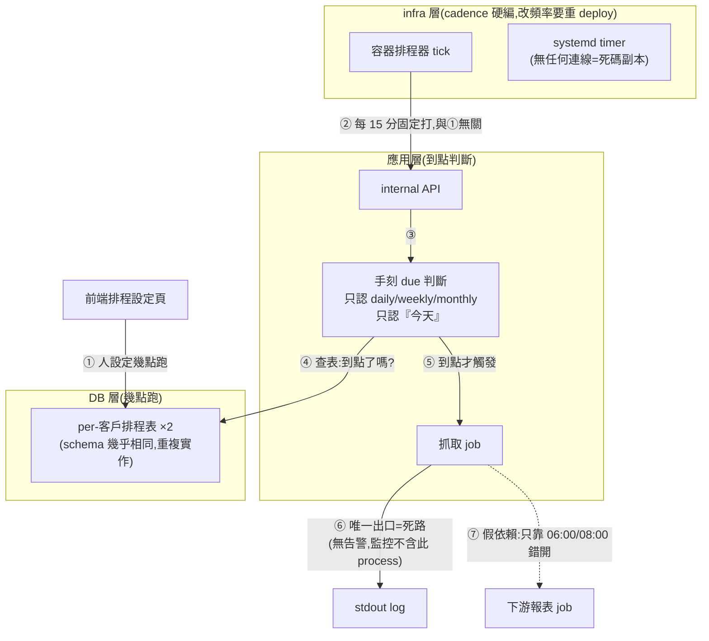
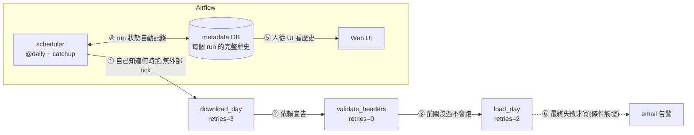

# 排程層採 Airflow,不採 cron/自建排程

本專案(多租戶 CSV 每日入倉)的排程層用 Airflow。我們沒有用 crontab,也沒有自己組一套「定時器 + 資料庫排程表 + 程式判斷」的排程。

這個決定的依據,是作者過去參與過的一個資料產品。那個產品的排程就是自己組出來的,實際運轉過,下面 Before 寫的每一件事都真實存在。為了保護相關公司,全文不出現產品名稱,以「該產品」代稱。

## Before:自建排程長什麼樣

該產品讓每個客戶自己決定資料什麼時候抓:在前端頁面選頻率(每天/每週/每月)和時間(幾點幾分),設定存進資料庫的排程表。

設定存進去之後,不會有任何東西在那個時間自己醒來。實際的觸發是另一條路:基礎設施層有一個定時器,每 15 分鐘固定呼叫一次後端的內部 API。後端收到呼叫,跑一段自己寫的判斷邏輯,去排程表裡查「有沒有哪個客戶設定的時間到了」。查到了,才執行那個客戶的抓取工作。

也就是說,「這個工作什麼時候跑」被拆在三個地方,各管一段:

- **每 15 分鐘檢查一次**——寫死在部署設定裡。想改這個頻率,要重新部署。
- **每個客戶幾點跑**——存在資料庫的排程表。
- **現在到點了沒**——寫在後端程式碼裡。只支援每天/每週/每月三種頻率,判斷只以「今天」為單位。

拆成三層之外,還有幾個看得出系統長歪的細節。同一份定時器設定在兩個地方各有一套(容器排程器一套、systemd 一套),其中一套早就沒在用,但一直留著。排程表有兩張,欄位幾乎一樣,一張管抓取、一張管報表,同樣的邏輯寫了兩次。客戶如果從來沒設定過排程,系統會自動幫他補一筆「每天 06:00」——所以有些客戶的排程,從頭到尾沒有被任何人決定過。

日常維運上,這個結構造成三個問題:

1. **失敗沒有人會知道。** 執行紀錄只印到容器的標準輸出。想知道昨晚有沒有失敗,工程師要自己連進容器翻 log。錯誤監控(Sentry)只裝在 API 服務上,真正執行抓取的那個程序不在監控範圍內。程式裡有一處註解寫著「已告警」,實際動作是印一行錯誤訊息,沒有任何通知寄出去。
2. **漏掉的那天不會補。** 判斷邏輯只認「今天」。機器停機一天,那天的抓取就永遠消失了——隔天恢復後照常跑隔天的,不會回頭。前端有「立即更新」按鈕,但它只能「現在跑一次」,不能指定要補哪一天。執行紀錄每個客戶只留最近 50 筆,報表那條路徑連紀錄表都沒有。
3. **工作的先後順序靠時間猜。** 抓取排早上六點,用抓取結果做的報表排八點,中間沒有任何真正的連結。如果抓取跑超過兩小時,或者失敗了,報表照樣八點開跑,用的就是舊資料。客戶一多、每家時間又不一樣,這種「用錯開的時間表達先後順序」的默契很快就管不動了。

## After:Airflow(本 repo T1.2–T1.5 的實作即實據)

Airflow 把拆在三處的東西收回一個地方:DAG 檔案。本 repo 的 `drive_ingestion` DAG(T1.2–T1.5,commit `87d29df`)就是實例——什麼時候跑(`@daily`)、步驟的先後順序(下載 → 驗表頭 → 入倉)、每一步失敗要不要重試、失敗要通知誰,全部寫在同一個檔案裡,而且進版本控制。接手的人讀這個檔案,就是在讀排程的全部真相。

對照 Before 的三個問題:

1. **失敗看得見了。** 每次執行的狀態、時間、log 自動存進 Airflow 的 metadata 資料庫,開網頁介面就能看,不用連進容器。任務最終失敗時寄 email 通知;重試過程中不寄,免得吵(`email_on_failure=True`、`email_on_retry=False`)。
2. **漏掉的補得回來。** Airflow 給每一次執行一個明確的日期,叫 logical_date;本專案約定「logical_date 是 D 的那次執行,負責檔案日是 D 的檔案」(詞條見 CONTEXT.md)。停機幾天後恢復,`catchup=True` 會把落掉的日期一天一天自動補跑。想重跑某一天,指定那個日期就行——配合分區替換(ADR 0002),重跑多少次結果都一樣。
3. **先後順序是宣告出來的。** `download_day >> validate_headers >> load_day` 這一行就是順序本身:前一步沒成功,後一步不會跑,報表不再有機會拿舊資料開工。重試次數也能按步驟分開設——下載失敗可能是網路問題,值得重試(3 次);表頭對不上是資料本身的問題,重試一百次也一樣(0 次)。

## 該產品若遷移,怎麼接

這套做法不是只有全新專案能用。對照該產品的現況,每個部件都有去處:

- 排程表裡每個客戶一列的設定,改由程式讀表、為每個客戶產生對應的 DAG(或同一個 DAG 帶不同參數)。客戶各自設定不同時間,Airflow 本來就支援。前端設定頁不用動;變的只是排程表的讀者,從手刻的判斷邏輯換成 DAG 產生邏輯。
- 每 15 分鐘的定時器、內部 API、手刻的到點判斷,整段刪除。這些事本來就是 scheduler 的工作。
- 「立即更新」按鈕改成手動觸發一次 DAG 執行,而且可以指定 logical_date——補跑從此能選要補哪一天。
- 產品內部已有的重試機制(outbox 的指數退避)管的是單一任務內部的重試,跟 Airflow 管的任務層級重試是不同層,原樣保留,不衝突。

證據的邊界要說清楚:三個理由裡,可觀測性、補跑、依賴宣告在本 repo 都有第一手實作,告警也實測過(Gmail SMTP)。「每個客戶不同排程時間」在本 repo 沒有對應需求——所有租戶共用一個每日 DAG——那部分的把握來自本段的推演,不是實作。

## Trade-off:為什麼有些團隊不該選 Airflow

crontab 一行就設好,而且每個工程師都懂。Airflow 要多養一整套服務:scheduler、網頁伺服器、metadata 資料庫——本 repo 為此常駐了好幾個容器。如果需求只是「每天固定跑一支腳本」,這個成本不划算,選 cron 是對的。對沒有資料工程背景的團隊,Airflow 還有學習門檻:大家不敢碰,就會退回保守用法,工具的能力發揮不出來。

本專案仍然選 Airflow,是因為需求已經超出 cron 舒服的範圍:多租戶、按日分區、要能補跑、失敗要通知。Before 的經驗是,在這個複雜度下堅持土法,上面每一個缺口都得靠人力和默契去填。

出處:T1.6 grilling(2026-08-28),Before 素材來自對該產品 codebase 的實地盤點。
