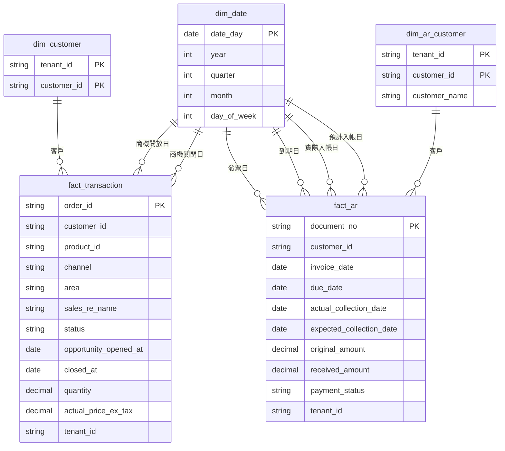

# star schema:兩張 fact、兩張客戶 dim、一本日曆;去重在 fact,描述改了直接蓋掉

Phase 2 的 dbt 建模層(T2.2)把 staging 的兩張表拆成星型結構:交易明細與應收帳款各一張 fact,各自配一張客戶 dim,兩張 fact 共用一張日期 dim。去重在 fact 這一層做,規則是「同一個主鍵留檔案日最新的那列」。客戶 dim 用上游代號當鍵、不另編代理鍵,名稱是屬性,改了直接蓋掉(SCD Type 1)。只有代號、沒有第二個屬性的欄位(產品、管道、區域、業務員、收款狀態、租戶)不拆,留在 fact 上。這些決定全部出自 T2.1 後、T2.2 前的 star schema grilling(2026-09-01 至 09-02)。

## 這一層要解什麼問題

藍本有 102 支指標 SQL,幾乎每一支都自己做三件事:用 `TO_CHAR` 現算月份、自己定「什麼算業績」(訂單狀態 = 成交、用商機關閉日)、直接 `SUM` 而假設表裡沒有重複列。三件事各寫 102 次,寫法漂掉沒人會發現,重複列讓金額翻倍也不會報錯。星型結構把這三件事各做一次:日曆表算一次,「一列一張訂單」在 fact 保證一次,「什麼算業績」在 CONTEXT.md 定義一次。T2.3 搬指標 SQL 過來時,只剩「哪個角度、加總什麼」。

老實說,以現在的資料量(兩張表各一千多列)拆完不會變快,也不會多出分析。它的實際價值是:T2.3 的 SQL 不用各自重算月份和去重;T2.4 的資料測試有正確的地方掛;以及這是資料工程面試的必考題。

## 表的形狀

表名是暫名,T2.2 可改;`fact_`、`dim_` 前綴是慣例。

**fact_transaction**:一列一張訂單,主鍵 `order_id`。刻意不叫 `fact_order`,因為藍本那張同名寬表結構完全不同,同名會混。留數字(銷售量、未稅售價)和指向各角度的代號。

**fact_ar**:一列一張單據(一張發票和它目前的收款狀態),主鍵 `document_no`。

**dim_date**:一本日曆,一列一天,附年、月、季、星期幾。整個倉庫只有這一本。fact_transaction 的商機開放日與商機關閉日兩個欄位各自查它;fact_ar 的發票日、到期日、實際入帳日、預計入帳日四個欄位各自查它。圖上會畫六條線指向同一張表,表還是一張(業界叫 role-playing dimension)。日曆多放一列「未知日」,理由見「缺日期用未知日」節。

**dim_customer**(交易明細的客戶)與 **dim_ar_customer**(應收帳款的客戶):兩張,不合併,理由見下一節。鍵都是 (tenant_id, customer_id)。dim_customer 現況只有鍵沒有屬性;dim_ar_customer 多一欄客戶名稱。鍵含租戶,所以「未知客戶」是每租戶各多一列(alpha、beta 各一),代號「其他」。

**檔案日**(`file_date`)留在兩張 fact 上,但不接 dim_date。它只回答「這列搭哪天的檔進來」,用途是對帳與重載,不是報表的角度。

六條線指向同一張 `dim_date`,每條線標角色(role-playing dimension);兩張客戶 dim 各自只接自己的 fact,不互通(見下一節)。

## 為什麼是兩張客戶 dim,不是一張

交易明細的客戶編號長 `CUST000005`(40 個值、沒名稱),應收帳款的客戶代碼長 `C00001`(8 個值、有名稱),兩邊沒有任何一個值相同。這不是產生器偷懶:藍本本身沒有客戶主檔,102 支 SQL 沒有一支把兩張表按客戶 join,兩套代號是藍本上傳格式的實況,而 ADR 0001 定了「產生器逐欄照抄藍本的上傳格式,不為模型好看去改」。

所以硬做一張客戶 dim 的結果是:交易明細拿 `CUST000005` 去查,一列都對不上,全是 NULL。建兩張、並在這裡寫明「訂單與應收不能按客戶對到一起」,是誠實;下游有人想做這件事時會先看到這行字,而不是做出來才發現。

## 鍵的三個決定

**鍵含租戶。** alpha 的 C00001 和 beta 的 C00001 是兩家,所以每張 dim 的鍵都是 (tenant_id, customer_id),不是 customer_id 單獨。

**名稱不進鍵。** 實查 staging,beta 的 C00001 有 60 列帶名稱「大同精密股份有限公司」、5 列名稱缺值。鍵只用 (tenant_id, customer_id) 時這 65 列是同一家,應收總額是一個數字,名稱缺的 5 列查 dim 會拿到名稱。名稱進鍵的話 C00001 會被切成兩家,總額拆開。藍本把名稱放進去重的鍵,是因為它沒有 dim 表、只能拿整列去重,那是將就不是設計。

**不編代理鍵。** dim 用上游代號的自然鍵,不另編一個整數 id。代理鍵的兩個好處(join 只比一欄;SCD Type 2 時區分同一客戶的多列)在這裡都用不到:資料量小,而且下面定了 Type 1。要升級 Type 2 時再加,走 dbt snapshot 會自動配一個。

## 去重在 fact,規則是同鍵取檔案日最大者

T2.1 定了 staging 不去重(原樣轉型,重複列留給 test 抓),ADR 0002 定了 raw 不去重。所以去重只剩 fact 這一層。規則:同一個主鍵有多列時,留檔案日最大的那列。

這條規則的重點是它對兩種情況都成立。現況的重複列是產生器整列原樣複製(`generator/dirty.py` 的 `pick_duplicate_sources`),兩份逐格相同,留哪一列結果都一樣。但 fact_ar 的收款金額與收款狀態是「狀態」不是「事件」:一張發票會從未收款走到全收款。如果上游哪天重送同一張單據的更新版,沒有規則的去重會隨機留一列;有這條規則就是最新狀態勝出。fact_transaction 用同一條規則,兩張 fact 一致。

反過來的做法——在 staging 就去重——會讓 T2.4 的 `unique` test 在 staging 永遠綠,不是因為資料乾淨,是因為重複列在 test 看到之前就被拿掉了。T2.4 的驗收「每一類髒資料至少被一個 test 抓到」會失敗。正確的燈號是:staging 的 unique test 紅(抓到 50 組),fact 的 unique test 綠(去重做對了),兩個燈缺一不可。

## 業績看商機關閉日

「1 月業績」看的是商機關閉日且訂單狀態為成交,沿藍本。一張 1 月開始談、3 月才成交的訂單算 3 月業績,因為開始談那天東西還沒賣出去。商機開放日仍在 fact 上、仍接 dim_date,只是它不是業績的角度。詞條「業績日」在 CONTEXT.md。

## 未知客戶用「其他」

交易明細 1,050 列裡有 50 列客戶編號缺值。fact 上留 NULL 的話,「按客戶看業績」這支 SQL join dim 時這 50 列要嘛消失、要嘛客戶欄空白,「按客戶」的總和會比「全部」的總和少一塊,報表上看不出少在哪。做法:fact 建表時把缺值換成「其他」,dim 手動多放一列「其他」。代號沿用藍本(藍本缺值時塞的字串就是「其他」),kun 裁示。

## 缺日期用「未知日」

同一個問題也發生在日期上:產生器的缺值池含商機開放日、發票日、實際入帳日(`generator/schema.py`),這些欄位缺值的列接 dim_date 時會跟缺客戶一樣,「按月」的總和比「全部」少一塊。做法對稱:dim_date 多放一列「未知日」,鍵用 `1900-01-01`(一個真實資料裡不會出現的日期),年、季、月、星期幾照日曆算;fact 建表時缺值的日期欄換成它。報表上看到 1900 年那一列就知道是缺日期的部分。沒有採用「fact 留 NULL、記為已知邊界」,因為那樣「按月加總 = 全部加總」不成立,而這正是建日曆表要保證的事。kun 裁示(2026-09-02,T2.2 任務卡議題 A)。

## 只有代號的欄位不拆

判準一句話:這個欄位除了代號本身,有沒有第二個屬性可以掛?有,拆;沒有,留在 fact 上直接 GROUP BY(業界叫 degenerate dimension)。

- 產品(`product_id`,P000001 到 P000030):沒名稱、沒分類、沒定價(售價在訂單列上)。不拆。
- 管道、區域、業務員、收款狀態:各只有四到五個值,沒有任何描述。不拆。
- 租戶(`tenant_id`,alpha 與 beta):沒有名稱、方案、合約日。不拆,不建 dim_tenant。

哪天上游長出屬性(業務員換區、租戶有方案)再拆。現在拆是為想像中的未來建表,一張一欄的 dim 只會多一個 join,查過去什麼都拿不到。

## 描述改了直接蓋掉(SCD Type 1)

dim_ar_customer 的客戶名稱如果改了,直接蓋掉那一列,1 月的發票查出來也顯示新名。改名視為修正。沒有採用 Type 2(新增一列、舊列標結束日、歷史保住),因為它要 dim 多兩個日期欄、fact join 時要挑當時有效的那列,而現況產生器出的資料沒有任何描述會變,這題純粹是紙上的設計決定。需要歷史時的升級路徑是 dbt snapshot:獨立一張表,不動 fact、不動現有 dim。

## 已知邊界

- **遲到列讓報表數字隨時間長大。** 歸屬 1/1 的 3 張訂單搭 1/3 的檔才進倉,1/2 早上跑「1 月至今業績」沒有它們,1/4 跑就有。這是資料晚到的正常現象,接受,不另做「以某時點為準」的機制。
- **fact_ar 是狀態快照,不保留收款歷程。** 一張單據只留最新狀態,收款從未收到全收的過程不在倉庫裡。
- **訂單與應收不能按客戶對到一起。** 見「為什麼是兩張客戶 dim」。
- **dim_customer 現況只有鍵。** 它存在是為了讓「未知客戶」有地方放、讓 fact 的客戶欄有 dim 可接,不是因為它現在有描述可掛。

## 相關詞條

租戶、客戶、未知客戶、業績日、遲到列、檔案日、歸屬日,定義都在 `CONTEXT.md`。

出處:star schema grilling(2026-09-01 至 09-02),講義為九站導覽,kun 逐題口試通過後定案。
